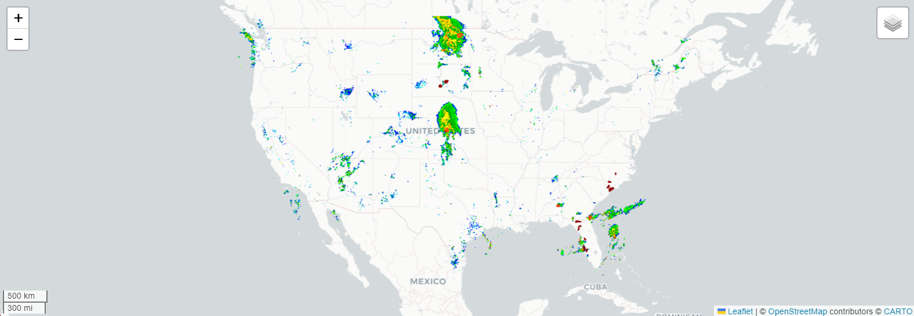

<h1> Precipitation webmap </h1>
 
 
The webmap provide real-time US precipitation and weather alert from National Weahter Service.

 > ℹ️ Access the webmap via this <a href =''>link</a>

<h2>Credit</h2>

 👨‍🏫 The webmap developed by <a href='https://vietducng.github.io/'>Viet Nguyen</a> (<a href = 'https://geo.uni-greifswald.de/en/chairs/geographie/translate-to-english-fernerkundung-und-geoinformationsverarbeitung/translate-to-english-team/'>University of Greifswald | Institute of Geography and Geology</a>) with reference to materials from the <a href='https://geog4046.github.io/'> GEOG 4046 An Introduction to Web GIS</a> course.

<h2>Data</h2>

<h3>🌧️ Precipitation layer</h3>

 
- <strong>Layer type</strong>: OGC Web Map Service   
- <strong>Summary</strong>: A National Weather Service image product depicting current precipitation derived from a network of radar stations. The web service is provided by <a href='https://mesonet.agron.iastate.edu/ogc/'>Iowa State University Mesonet</a>.   
- <strong>Service URL</strong>: <a href='https://www.weather.gov/documentation/services-web-api#/default/get_alerts_active'> <i> https://www.weather.gov/documentation/services-web-api#/default/get_alerts_active </i></a>  

<h3> 🌪️ Weather alerts layer</h3>

 
- <strong>Layer type</strong>: GeoJSON   
- <strong>Summary</strong>: Areas under a weather alert issued by the National Weather Service, such as a tornado warning. See the NWS for <a href = 'https://www.weather.gov/documentation/services-web-api#/default/get_alerts_active'>details on the API</a>.   
- <strong>Service URL</strong>: <a href='https://{s}.tile.openstreetmap.org/{z}/{x}/{y}.png'> <i> https://{s}.tile.openstreetmap.org/{z}/{x}/{y}.png </i></a>  

